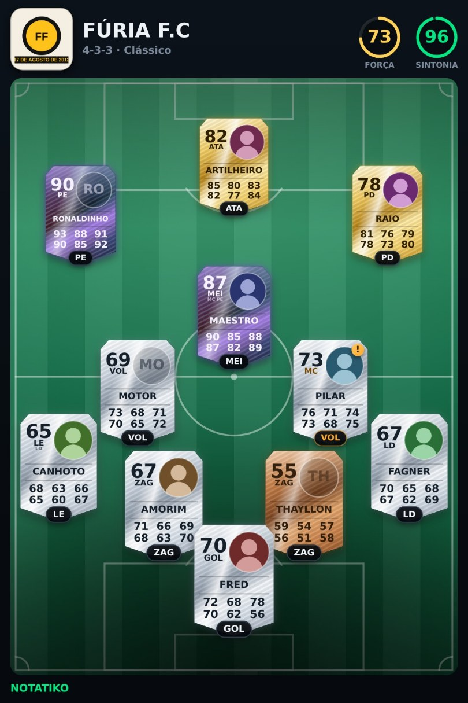
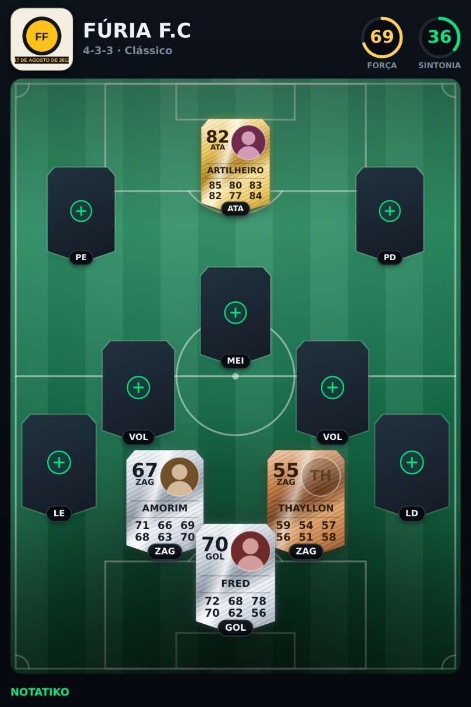

# NoTatiko

Monte seu time de futebol com cards de score. Crie jogadores com foto, posição e
características, escolha a tática e escale os 11 em campo — tudo offline, direto
do navegador.


## O que dá para fazer

- **Criar o clube** — nome e escudo, que aparece no topo do app e na imagem que você compartilha.
- **Criar jogadores** — a carta *é* o formulário: o apelido se escreve nela, a
  foto se troca tocando nela, e as seis características (Ritmo, Finalização,
  Passe, Drible, Defesa, Físico) viram um hexágono que se molda com o dedo.
  A posição não vem escolhida — é a escolha dela que dá forma ao jogador.
  Confirma-se deslizando, não apertando botão.
- **Escalar** — arraste do elenco para o campo, ou toque no jogador e depois na posição. As cartas voam até o lugar.
- **19 táticas** — 10 formações com variações (4-4-2 Losango, 4-3-3 Falso 9, 3-5-2 Alas ofensivos…), escolhidas pelo desenho do time.
- **Guardar escalações** — o time completo vira ficha no fichário, com nome:
  a tática, a variação e quem estava em cada vaga. Depois, um toque devolve os
  onze ao campo — dá para ter um time para cada jogo. O marcador no placar
  abre o fichário.
- **Força e Sintonia** — duas medalhas no placar, com o arco contando o valor.
  Toque para ver de onde cada número saiu.
- **Compartilhar** — a escalação vira uma imagem do campo, com as cartas dos
  onze nas posições da tática.

## Como as notas funcionam

São **dois ofícios, não um**. O jogador de linha tem Ritmo, Finalização, Passe,
Drible, Defesa e Físico; o goleiro tem Elasticidade, Manejo, Reflexos,
Posicionamento, Reposição e Velocidade. "Defesa" de um zagueiro é marcação; de
um goleiro é defender chute — eram duas coisas medidas pelo mesmo número.

A nota é a média das seis **ponderada pela posição em que ele está jogando**: um
zagueiro vale pela defesa e pelo físico; um atacante, pela finalização e pelo
ritmo. Escalar fora de posição custa nota de verdade.

Cruzando a fronteira do gol não há atributo em comum, então a nota vira uma
aproximação declarada: um jogador de linha no gol vale pelo que leva para lá
(defesa, físico e ritmo) e um goleiro na linha, pela saída e pelo pé — os dois
com desconto pesado, porque improvisar no ofício alheio custa caro.

Cada jogador pode ter até **duas segundas funções**. Jogar numa delas não conta
como improviso e quase não custa sintonia. A fronteira do gol não se atravessa:
goleiro não é alternativa de ninguém, nem ninguém é alternativa de goleiro.

- **Força** — média das notas dos 11 nas posições em que foram escalados.
- **Sintonia** — o quanto o time joga onde sabe. Posição principal vale 100%,
  uma segunda função 85%, mesmo setor 60%, setor vizinho 25%.

## Compartilhando

Não há servidor, conta nem link: o app desenha a escalação e entrega à folha
de partilha do sistema — o mesmo caminho de uma foto. Quem escolhe o destino
é você, e nada sai por conta própria. Onde não existe folha de partilha (a
maioria dos navegadores de computador), a imagem é baixada; no celular, dá
para segurar na prévia e salvar direto na galeria.

Sai uma imagem justamente porque não há servidor: imagem qualquer um vê, no
grupo do WhatsApp, sem instalar nada. Não é preciso ter o NoTatiko do outro
lado.



São 1080×1620: escudo e nome no topo, as duas medalhas do placar, e o gramado
ocupando o resto com **as cartas dos onze** — a mesma carta da tela, com o
chanfro, a liga metálica do tier, a nota com a posição, a foto, o nome e as
seis características. A pílula debaixo de cada carta diz a vaga da tática, em
âmbar quando o jogador está improvisando ali; a carta diz o que ele é, a
pílula diz onde ele está jogando.

O campo é desenhado num `canvas`, não fotografado da tela: a tela do celular
é estreita, tem placar, elenco e barra do sistema, e o que se manda para o
grupo tem que caber num quadro só, do mesmo tamanho em qualquer aparelho. As
linhas saem do mesmo desenho do `index.html`; a carta é descrita em `em`,
como no CSS, e o `em` sai do tamanho do slot — as proporções são as da tela
em qualquer tamanho de saída. Nota, tier e improviso chegam prontos do
domínio: a imagem nunca discorda do campo.

Vaga aberta vira carta vazia, com a etiqueta da posição — o time pela metade
se compartilha do mesmo jeito:



### O que ficou de fora, e por quê

- **A marca no gramado.** Ela já morou no círculo central, em luminosidade
  como no app, e depois no canto do campo. Nos dois lugares disputava espaço
  com as cartas — e o escudo já está no topo, do lado do nome. Uma vez só
  basta. Pelo mesmo motivo ela saiu também do círculo central do app: lá
  ficava atrás das cartas, e o gramado é do time, não da marca.
- **O recorte da marca no formato do brasão.** O placar do app corta em forma
  de escudo porque ali ele é um emblema de 34px; numa imagem que representa o
  clube, escudo redondo perdia os lados e faixa com o ano de fundação sumia.
  A marca agora vai inteira numa placa quadrada de pontas arredondadas, que
  não corta nem obriga a encolher. A placa toma a cor de fundo da marca
  quando ela tem uma só — a borda do arquivo desaparece e o conjunto lê como
  um emblema só. É a mesma placa do emblema do placar e da ficha do clube:
  o que se vê no app é o que sai na imagem.
- **A contagem de "x de 11 em campo".** Quem olha a imagem conta os onze
  sozinho. O rodapé ficou só com a assinatura, e o lugar dela virou campo.

## O fichário

Tática é o desenho; escalação é o desenho com os onze dentro. Guardar só a
tática não devolveria o time — quem monta um 4-3-3 de bola no chão e um 3-5-2
de bola longa quer os dois de volta com cada um no seu lugar. Por isso a ficha
guarda as três coisas: formação, variação e quem estava em cada vaga.

O que ela guarda são **ids, não cópias dos jogadores**. Editar a carta de
alguém depois de guardar não deixa a ficha contando a versão velha dele, e
Força e Sintonia são recontadas na hora de abrir o fichário — o que está
guardado nunca discorda do campo. Quem foi dispensado deixa a vaga aberta: a
bolinha no campinho da ficha fica apagada, e voltar ao campo escala os que
ficaram. É a mesma conferência que apara a escalação que vem do banco.

Só time completo entra: meio time guardado não serve para nada — voltar ao
campo devolveria as mesmas vagas abertas, e a Força de sete jogadores não
compara com a de onze. Com o time pela metade a ficha diz quantos faltam e o
deslizar recusa.

Guardar não exige digitar: o campo de nome vazio já mostra o nome que a
escalação terá, que é a própria tática. Nome que já existe pergunta antes de
substituir — é essa a forma de atualizar uma ficha, em vez de ficar com duas
com o mesmo rótulo.

O fichário se abre pelo marcador no placar, e também pela ficha da tática —
lá a primeira linha leva a ele e diz quantas escalações estão guardadas.

Ele nasceu só atrás da placa da tática, e estava escondido: quem quer guardar
o time olha para o placar, onde já estão as ações da escalação. O glifo no
placar é pago em pontos de largura, porque a linha do placar não cresce: o vão
entre os controles cai de 8 para 7 e os glifos de 30 para 28, o que devolve 16
dos 35 pontos que o marcador ocupa. O resto sai do nome do clube — em 390
pontos de tela ele ainda cabe inteiro; em 375 e abaixo passa a cortar com
reticências, como já cortava em 320. Nome inteiro há na ficha do clube e na
imagem compartilhada; a opção de guardar, se não se vê, não existe.

## Rodando localmente

```bash
python3 serve.py
```

Abre em `http://localhost:4173`. O `serve.py` é um servidor estático simples com
cabeçalhos anti-cache — útil porque o Service Worker atrapalha o
desenvolvimento quando o navegador guarda versões antigas.

## Como foi feito

Sem framework, sem build, sem dependências: HTML, CSS e JavaScript com módulos ES.

| Arquivo | Papel |
|---|---|
| `js/app.js` | Estado, renderização, arrastar e soltar, animações |
| `js/taticas.js` | As 19 táticas e suas coordenadas em campo |
| `js/db.js` | Persistência em IndexedDB |
| `js/campo.js` | O desenho do campo: marcações e comprimento, para o app e para a imagem |
| `js/compartilhar.js` | A imagem da escalação, desenhada no `canvas` |
| `js/audio.js` | Trilha sonora, efeitos das ações e narração |
| `audio/trilha.mp3` | O loop da trilha, renderizado da própria síntese |
| `js/falas.js` | As 42 frases da narração |
| `js/icones.js` | Ícones em SVG |
| `sw.js` | Service Worker — cache para funcionar offline |

Os dados ficam no próprio aparelho (IndexedDB). Nada é enviado para servidor
nenhum: sem contas, sem back-end, sem rastreio. Compartilhar também não muda
isso — a imagem é desenhada no aparelho e entregue à folha de partilha do
sistema, que é quem pergunta para onde ela vai.

## Som

Nada de música de terceiros: tudo é sintetizado pelo próprio código, e o que
vira arquivo é renderização dessa mesma síntese.

- **Trilha** — loop de quatro compassos (I-V-vi-IV em Lá maior, 108 BPM) com
  bumbo, chimbal, baixo sincopado, arpejo e naipe sustentado. Toca de
  `audio/trilha.mp3` (140 KB, 8,9 s em loop), renderizado a partir da classe
  `TrilhaSintetica`. Se o arquivo não carregar, a síntese ao vivo assume.
- **Efeitos** — 11 sons derivados da mesma escala da trilha, então qualquer
  combinação soa consonante. Tocam de `audio/efeitos/` (51 KB no total),
  renderizados da própria síntese com um ganho único, para a mixagem entre
  eles sobreviver. A síntese ao vivo fica como reserva.

### Por que tudo virou arquivo

No iOS o Web Audio sai pelo canal da campainha, e a chavinha lateral do iPhone
o silencia; um `<audio>` sai pelo canal de mídia e não é afetado.

A trilha em `<audio>` chegou a resolver os efeitos de tabela — enquanto ela
tocava, a sessão do sistema ficava em modo mídia e o Web Audio voltava a ser
ouvido. Mas era dependência frágil: bastou o painel do som permitir calar a
música para os efeitos sumirem junto. Por isso eles também viraram arquivo, e
o Web Audio deixou de estar no caminho crítico.

### Gerando a trilha

Sirva o projeto e abra
`http://localhost:4173/ferramentas/gerar-trilha.html`. A página renderiza o
loop com as vozes reais da trilha, monta a emenda sem estalo (dobra para o
início a cauda que passa do fim), normaliza em −1 dBFS e baixa o WAV:

```bash
ffmpeg -y -i trilha-bruta.wav -codec:a libmp3lame -b:a 128k -ac 1 audio/trilha.mp3
```
Trilha, efeitos e narração têm chaves separadas no painel do som: dá para
calar a música e continuar ouvindo o narrador.

- **Narração** — 117 frases para os momentos do time (criou jogador, trocou
  para melhor, trocou para pior, improvisou na posição, mudou a tática,
  dispensou, tocou em quem já está escalado) e para o silêncio: parado com o
  time pela metade, o narrador cutuca. Ela toca por dois caminhos, nesta
  ordem:

  1. as gravações de `audio/falas/` — 117 arquivos, 1 MB. Havendo
     gravações, o sorteio só considera frases que têm áudio: acrescentar
     frase ao catálogo nunca mistura a voz gravada com a do aparelho no meio
     da mesma sessão. Mesmo timbre em qualquer aparelho, sem depender do sistema
     operacional. O Service Worker guarda todas na instalação, então
     funcionam offline;
  2. a voz do próprio aparelho (Web Speech API), se as gravações não
     carregarem. Sem voz instalada no sistema, o app segue só com música e
     efeitos.

### Gerando as gravações

As frases moram em `js/falas.js`, que é a fonte única: o texto que aparece
na tela e o que a voz diz saem da mesma lista.

```bash
printf %s 'sua-chave' > .chave-elevenlabs         # ignorado pelo git
python3 ferramentas/gerar-vozes.py --vozes        # escolhe a voz
python3 ferramentas/gerar-vozes.py --voz <id>     # gera audio/falas/
```

A chave também pode vir de `ELEVENLABS_API_KEY`, desde que exportada na
mesma shell que roda o script.

São ~2300 caracteres no total, bem dentro da cota gratuita mensal do
ElevenLabs. O script pula o que já existe, corta o silêncio das pontas e
nivela o volume entre as frases. O índice lista só o que tem mp3 no disco.

Trocar o **texto** de uma frase sem mudar a posição dela é o caso perigoso:
o arquivo se chama grupo+posição, então o mp3 antigo continuaria no lugar
dizendo outra coisa. O script compara o catálogo com o índice anterior e
regera só o que mudou (`--refazer` força tudo).

**Licença:** áudio gerado no plano gratuito do ElevenLabs vem com restrição
de uso comercial e pedido de atribuição. Confira os termos do seu plano
antes de publicar as gravações.

Um botão no topo silencia tudo de uma vez.

## O campo

O gramado tem 68 metros de largura e um comprimento que acompanha a tela.

A largura manda em tudo que é marcação — grande área, pequena área,
meia-lua, círculo central: todas medidas a partir dela, como num campo de
verdade. O que sobra de tela vira meio-campo. A regra do futebol admite de 90
a 120 metros de comprimento para 68 de largura, o que dá de 0,76 a 0,56 de
proporção; dentro dessa faixa o campo continua sendo campo, e o desenho nunca
precisa ser esticado para preencher a tela.

Isso existe por causa do círculo do meio. Antes o desenho tinha proporção fixa
e era esticado até a caixa (`preserveAspectRatio="none"`): num iPhone em pé a
caixa ficava em 0,57 contra os 0,75 do desenho, e o círculo saía 33% mais alto
que largo. Esticar o desenho é o único jeito de um círculo sair achatado — e
encolher o campo para caber a proporção antiga custaria a tela que o campo
ocupa. Com o comprimento variável não se paga nem um nem outro.

As marcações moram em `js/campo.js`, numa lista de primitivas em unidades de um
campo de 680 de largura. O app as desenha em SVG; a imagem compartilhada, em
`canvas`. Campo escrito duas vezes é campo que um dia deixa de bater com o
outro.

## Profundidade

Sem perspectiva no gramado. Inclinar o campo em `rotateX` é o gesto óbvio de
"3D", mas custa justamente o que mais falta no celular: altura. A ponta longe
comprime, a perto pede folga, e o campo encolhe — foi tentado e os atacantes
acabaram fora da grama.

A profundidade vem de luz e sombra, que não custam layout: o gramado é uma
bacia iluminada de cima, e a sombra de cada carta cresce com o `--escala`, que
já aumenta conforme a carta se aproxima da base do campo. A carta da ficha,
essa sim, gira em perspectiva sob o dedo, com o brilho correndo pela
superfície.

## Instalando como app

Abra no celular e use "Adicionar à tela de início". É um PWA: instala, abre em
tela cheia e funciona sem internet.

## Testes

```bash
python3 serve.py
```

Com o app aberto, no console do navegador:

```js
const t = await import('./ferramentas/e2e.js'); await t.rodar();
```

São 37 testes ponta a ponta contra o DOM e o IndexedDB de verdade: fundar o
clube, criar jogador pela carta, moldar o radar, escalar, trocar de tática,
sobreviver a uma recarga, o campo ocupar a tela, não sobrar comportamento de
página web, o círculo do meio-campo ser redondo, o fichário recusar time pela
metade e devolver a guardada inteira ao campo, a escalação virar imagem do
tamanho certo, a marca do clube sair inteira e os onze irem como carta (os
dois conferidos pixel a pixel) e o cache offline estar completo. Três deles
recarregam a página — depois da recarga, continue com `await t.continuar()`.
